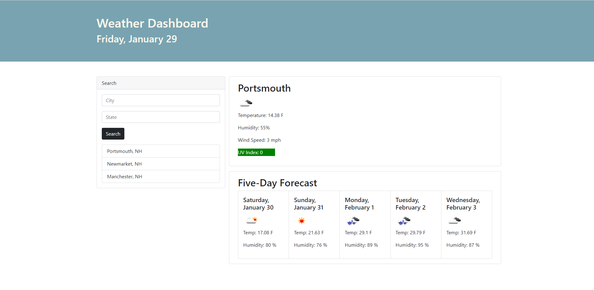

# Weather Dashboard

Application: https://tjvig94.github.io/weather-dashboard/

## Overview

The Weather Dashboard application allows users to search for a city or town and receive weather information for the current day, and the proceeding 5 days. As users search for cities, their recent searches are saved in a list which they can use to quickly load weather data for those prior searches.

## Openweather API's

Openweather's Geocoding API is used to acquire a city's latitudinal/longitudinal location, which is then used for a request through Openweather's One Call API to get weather data for that location. Basic date information is also parsed from the Open Call API's response.

## Bootstrap and a Dynamic Page

Bootstrap is used for the structure of the page, which is simply a header and 3 cards. The page is designed is that it can be easily viewed on mobile devices as well.

The page is dynamic, meaning that as API requests are fulfilled, the elements are filled with that data.

## License (MIT)
Copyright 2021, Tim Vigneau

Permission is hereby granted, free of charge, to any person obtaining a copy of this software and associated documentation files (the "Software"), to deal in the Software without restriction, including without limitation the rights to use, copy, modify, merge, publish, distribute, sublicense, and/or sell copies of the Software, and to permit persons to whom the Software is furnished to do so, subject to the following conditions:

The above copyright notice and this permission notice shall be included in all copies or substantial portions of the Software.

THE SOFTWARE IS PROVIDED "AS IS", WITHOUT WARRANTY OF ANY KIND, EXPRESS OR IMPLIED, INCLUDING BUT NOT LIMITED TO THE WARRANTIES OF MERCHANTABILITY, FITNESS FOR A PARTICULAR PURPOSE AND NONINFRINGEMENT. IN NO EVENT SHALL THE AUTHORS OR COPYRIGHT HOLDERS BE LIABLE FOR ANY CLAIM, DAMAGES OR OTHER LIABILITY, WHETHER IN AN ACTION OF CONTRACT, TORT OR OTHERWISE, ARISING FROM, OUT OF OR IN CONNECTION WITH THE SOFTWARE OR THE USE OR OTHER DEALINGS IN THE SOFTWARE.

## Contact
Email: tjvig94@gmail.com
